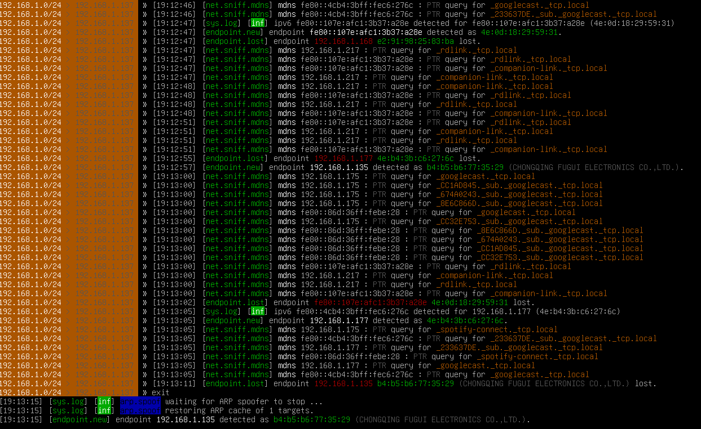
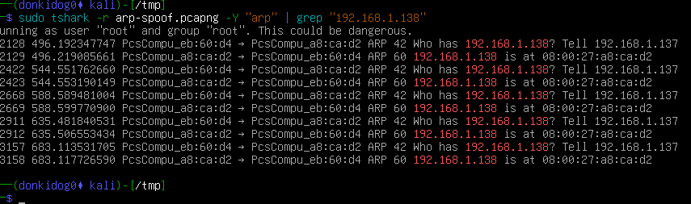
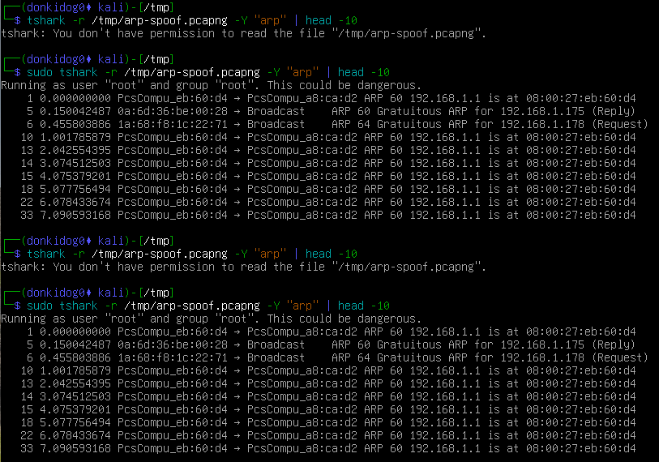

## Day 01: ARP Spoofing & Sniffing

**Environment:**
- Attacker: Kali Linux
- Target: Metasploitable (IP `192.168.1.138`)
- Gateway: `192.168.1.1`

---

## 1. Network Traffic Capture (Data Collection)

**Command:**
```bash
cd /tmp

```bash
sudo tshark -i eth0 -w arp-spoof.pcapng```

**What it does:**
Starts capturing all packets passing through the `eth0` interface and saves them to the file `arp-spoof.pcapng`. This allows for later forensic analysis of the traffic.

---


## 3. Connectivity Verification

**Command:**

```bash
ping -c 4 192.168.1.178
```

**What it does:**
Sends 4 ICMP (Ping) packets to IP `192.168.1.178` (the Kali machine's IP). This confirms that the target (Metasploitable) can communicate with the attacker before the attack begins.

> Note: Pinging `192.168.1.100` returned "Destination Host Unreachable," indicating that this IP was not active on the network at the time.

---

## 2. ARP Spoofing + Sniffing Attack (Offensive Action)

**Command:**

```bash
sudo bettercap -eval "set targets 192.168.1.138; arp.spoof on; net.sniff on"
```


**What it does:**
Performs the main Man-in-the-Middle (MITM) attack:

1. `set targets 192.168.1.138`: Defines the Metasploitable machine as the exclusive target.
2. `arp.spoof on`: Activates ARP poisoning. Kali sends fake ARP packets to the network, causing the target's traffic to pass through Kali first before reaching the gateway.
3. `net.sniff on`: Activates the network sniffer. All packets passing through Kali are captured and displayed in real time.

---
## 3. Initial Analysis of ARP Packets

**Command:**

```bash
sudo tshark -r /tmp/arp-spoof.pcapng -Y "arp" | head -10

```bash
sudo tshark -r arp-spoof.pcapng -Y "arp" | grep "192.168.1.138"
```

**What it does:**
Reads the `.pcapng` file generated in the previous step, filters only **ARP** protocol packets, and displays the first 10 lines. This step confirms that the network is exchanging ARP messages (Requests, Replies, Gratuitous ARP) between devices.

- Observed repeated ARP replies from the Kali machine (`08:00:27:eb:60:d4`) to the victim machine (`08:00:27:a8:ca:d2`).
- The ARP message `192.168.1.137 is at 08:00:27:eb:60:d4` indicates that the victim received falsified ARP information from the attacker.
- These repeated ARP advertisements show that ARP poisoning was successful.
- The attacker was able to position itself between the victim and other network devices, allowing victim traffic to be redirected through the attacker's machine.
- This behavior enabled a Man-in-the-Middle (MITM) attack.



---

## Final Result

Bettercap ran in interactive mode and displayed detailed logs of intercepted traffic, including `DNS`, `HTTP`, and `Spotify` connections. This proves the attack was successful and that the target's network traffic was being intercepted and analyzed.


 